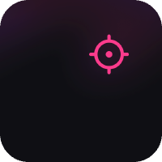
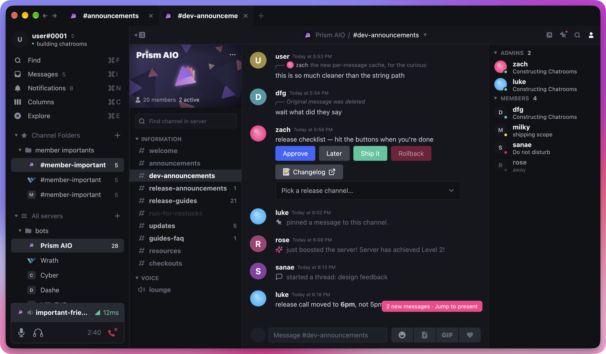

<h1><b>Scope</b></h1>

The Discord client for power users.
 
<a href="https://www.scopeclient.com/"><strong>scopeclient.com »</strong></a>

<table>
  <tbody>
    <tr>
      <td>No Release Downloads Yet</td>
    </tr>
  </tbody>
</table>

###### Scope is in its earliest stages of development. This README will be fleshed out as the project progresses.

## Building the Project

### Prerequisites

- [Rust & Cargo](https://doc.rust-lang.org/cargo/getting-started/installation.html) (stable; `rust-toolchain.toml` picks it up)
- Linux only: Vulkan, `libxkbcommon`, X11/Wayland dev packages. `shell.nix` has the full list (`nix-shell`).

### Steps

1. Clone the repository
2. Run `cargo build --release`
3. The binary will be in `./target/release/scope`

## Development Setup

1. Clone the repository
2. Run `cargo run`
   - `cargo watch -- cargo run` from [cargo-watch](https://github.com/watchexec/cargo-watch) is handy, but optional
   - `SCOPE_DEMO=1 cargo run` runs against `scope-backend-demo`: an offline backend with sample servers, history, sends, and a background task that posts messages, flips presence and bumps unread badges — useful for UI work

## Signing in

On first launch Scope shows a login screen where you paste a Discord token. For now use a **bot token**
(create an application in the Developer Portal, add a bot, enable the Presence, Server Members and
Message Content intents, invite it to a test server). User-account tokens work through the unofficial
client path and are behind a toggle on the login screen.

To skip the screen, put the token in a `.env` file (or the environment):

- `DISCORD_BOT_TOKEN` — a bot token, or
- `DISCORD_TOKEN` + `DISCORD_TOKEN_KIND=bot|user`

See `.env.example`.

## Tech

- UI: [gpui](https://crates.io/crates/gpui) + [gpui-component](https://crates.io/crates/gpui-component)
- Backends plug into the `Backend` trait (`src/ui/src/backend.rs`); the chat traits live in `src/chat`
- Discord: a fork of [serenity](https://github.com/scopeclient/serenity) with user-account support (`src/discord`)
- Demo: `src/demo` — offline sample backend
- Design tokens live in `src/ui/src/theme/tokens.rs`, exported from the Figma file

## Credits

- Emoji graphics: [Twemoji](https://github.com/jdecked/twemoji) (jdecked fork, v17.0.3), licensed [CC-BY 4.0](https://creativecommons.org/licenses/by/4.0/).
